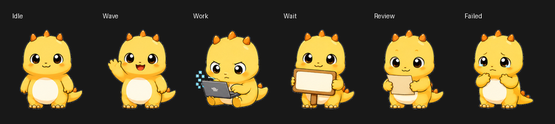

# 奶小龙 Codex 桌宠

奶小龙是一个给 Codex Desktop 用的自定义桌宠。它会出现在 Codex 的 Pets 功能里，根据 Codex 的空闲、等待、工作、审查、失败等状态切换动作。



它不是独立桌宠软件，需要先安装 Codex Desktop。

## 安装

下载 Release 里的 `nai-xiaolong-codex-pet-v1.0.0.zip`，解压后在 PowerShell 里运行：

```powershell
powershell -ExecutionPolicy Bypass -File .\install.ps1
```

然后打开 Codex：

```text
Settings -> Appearance -> Pets -> Refresh -> Select 奶小龙 -> Wake Pet
```

中文界面一般是：

```text
设置 -> 外观 -> Pets -> 刷新 -> 选择 奶小龙 -> Wake Pet
```

## 更新

下载新版 Release，重新运行 `install.ps1` 即可。脚本会在覆盖前保留旧版本备份。

## 卸载

在解压目录运行：

```powershell
powershell -ExecutionPolicy Bypass -File .\uninstall.ps1
```

脚本会把已安装目录移动为备份，不会删除你的其他 Codex 文件。

## 文件结构

```text
pet/
  pet.json
  spritesheet.webp
install.ps1
uninstall.ps1
README.md
```

## 兼容性

当前宠物包遵循 Codex Desktop 自定义宠物图集格式：

- 图集尺寸：`1536x1872`
- 网格：`8 列 x 9 行`
- 单格：`192x208`
- 背景：透明

## 说明

如果安装后没有看到奶小龙，先重启 Codex，或在 Pets 设置页点击 Refresh。

## License

MIT
